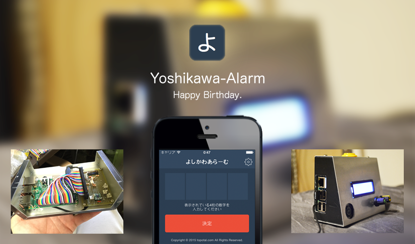

# よしかわアラーム(Yoshikawa-Alarm)

よしかわアラーム is a birthday present for [@rrreeeyyy](https://twitter.com/rrreeeyyy).
This codes work with The Raspberry Pi.



# Installation

## Pythonz 

```
sudo su -
apt-get install -y build-essential zlib1g-dev libbz2-dev libssl-dev libreadline-dev libncurses5-dev libsqlite3-dev libgdbm-dev libdb-dev libexpat-dev libpcap-dev liblzma-dev libpcre3-dev
curl -kLO https://raw.github.com/saghul/pythonz/master/pythonz-install
chmod +x pythonz-install
./pythonz-install
echo '  [[ -s /usr/local/pythonz/etc/bashrc ]] && source /usr/local/pythonz/etc/bashrc' >> ~/.bashrc
. .bashrc
pythonz install 2.7.9
```


## Virtualenv

```
sudo su -
apt-get install -y python-virtualenv virtualenvwrapper
mkvirtualenv -p /usr/local/pythonz/pythons/CPython-2.7.9/bin/python2.7 --distribute alarm
workon alarm
```

## Install Python Packages

```
cd /opt
git clone https://github.com/topotal/alarm.git
cd alarm
pip install -r requirements.txt
```

## install supervisor

```
apt-get install -y supervisor
cd /opt/alarm
cp ./config/supervisord/*.conf /etc/supervisor.d
service supervisor restart
```

## install pygame on Ubuntu

```
apt-get install -y libsdl-dev libsdl-image1.2-dev libsdl-mixer1.2-dev libsdl-ttf2.0-dev libsmpeg-dev libportmidi-dev libavformat-dev libswscale-dev libv4l-dev
cd /usr/include/linux
ln -s ../libv4l1-videodev.h videodev.h
```

## install pygame on OSX 
```
brew tap homebrew/headonly
brew install smpeg --HEAD
brew install sdl sdl_image sdl_mixer sdl_ttf portmidi
pip install hg+http://bitbucket.org/pygame/pygame
```


## License

よしかわアラーム is released under the [MIT License](http://www.opensource.org/licenses/MIT).
